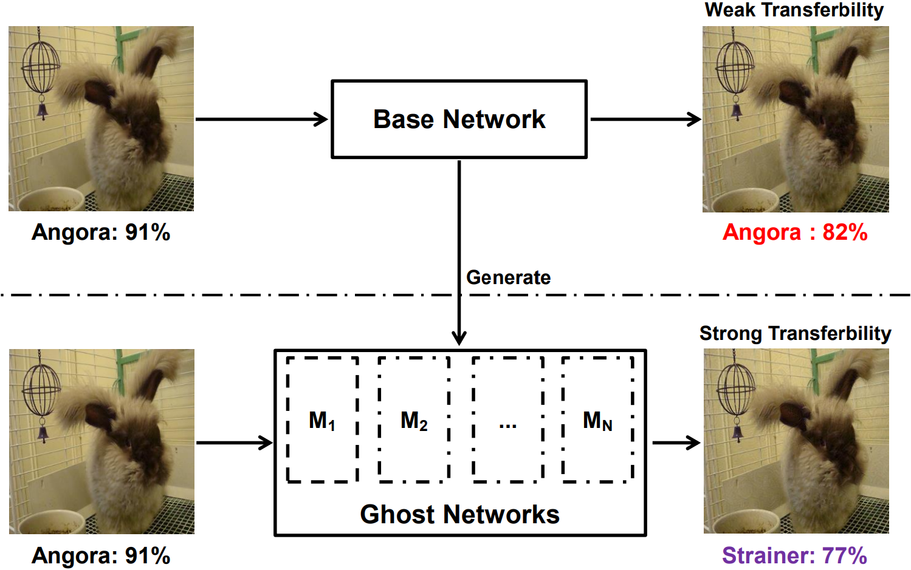

# Improving Transferability of Adversarial Examples with Input Diversity

This paper proposed to improve the transferability of adversarial examples by creating diverse input patterns. Instead of only using the original images to generate adversarial examples, our method applies random transformations to the input images at each iteration. The generated adversarial examples are much more transferable than FGSM and I-FGSM, and an example is shown below:

## Relationship to other attacks

This attack can be related to other attacks via different parameter settings, as shown below

## Inception_v3 model

- http://download.tensorflow.org/models/inception_v3_2016_08_28.tar.gz

## Citing this work

If you find this work is useful in your research, please consider citing:

    @article{xie2018improving,
          title={Improving Transferability of Adversarial Examples with Input Diversity},
          author={Xie, Cihang and Zhang, Zhishuai and Wang, Jianyu and Zhou, Yuyin and Ren, Zhou and Yuille, Alan},
          year={2018}
    }
